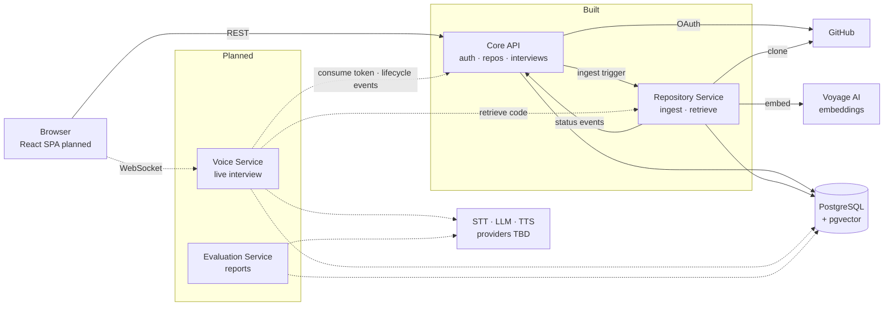

# RepoViva

A voice-based interview coach for developers. Connect a GitHub repository, and RepoViva studies the actual code, then runs a spoken mock interview grounded in that code — asking questions, following up on your answers, and producing a feedback report at the end.

## Why

Developers prepare with generic interview questions but often struggle to explain and defend the projects they actually built. RepoViva lets you practise talking about your own code.

## Architecture

Four Python microservices in a monorepo, sharing one PostgreSQL + pgvector database (each service owns its own tables). Internal calls are HMAC-signed HTTP.



*Solid lines are implemented; dashed lines are planned.*

| Service | Role | Status |
|---|---|---|
| [core-api](core-api/) | GitHub OAuth, users, repositories, interviews, report metadata | Auth, repositories, interview creation and session-token consumption implemented |
| [repository-service](repository-service/) | Clone, chunk, embed and retrieve repository code | Ingestion and retrieval implemented |
| [voice-service](voice-service/) | Live interview over WebSocket (STT → retrieval → LLM → TTS) | Not started |
| evaluation-service | Generates the end-of-interview report | Not started |
| frontend | React + Vite + TypeScript SPA | Not started |

Details: [docs/architecture.md](docs/architecture.md). The reasoning behind every choice: [docs/decisions.md](docs/decisions.md).

## Tech stack

- **Backend:** Python 3.11+, FastAPI, `uv`, pytest, ruff
- **Database:** PostgreSQL 16 + pgvector (Docker Compose locally)
- **Ingestion:** CocoIndex (syntax-aware chunking), Voyage `voyage-4-lite` embeddings
- **Frontend:** React + Vite + TypeScript (planned)
- **STT / TTS / LLM providers:** not chosen yet

## Running locally

Prerequisites: Python 3.11+, [`uv`](https://docs.astral.sh/uv/), Docker, Git.

```bash
# 1. Start Postgres (pgvector)
docker compose up -d

# 2. Start each service — see its README for .env setup
cd core-api && uv sync && uv run alembic upgrade head && uv run uvicorn core_api.main:app --reload --port 8000
cd repository-service && uv sync && uv run uvicorn repository_service.main:app --reload --port 8001
```

Both services must share the same `INTERNAL_HMAC_SECRET`.

## Project status

Working end to end: GitHub login → submit a repository → background ingestion (clone, chunk, embed) with status callbacks → retrieval over the indexed code → create an interview and receive a single-use session token → exchange that token through Core API's internal consume endpoint, which starts the interview.

Next: Voice Service (live session and question generation, consuming the token at connect), then Evaluation Service and the frontend.
