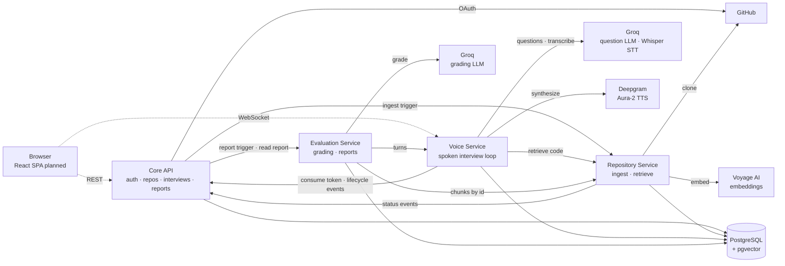

# RepoViva

A voice-based interview coach for developers. Connect a GitHub repository, and RepoViva studies the actual code, then runs a spoken mock interview grounded in that code — asking questions, following up on your answers, and producing a feedback report at the end.

## Why

Developers prepare with generic interview questions but often struggle to explain and defend the projects they actually built. RepoViva lets you practise talking about your own code.

## Architecture

Four Python microservices in a monorepo, sharing one PostgreSQL + pgvector database (each service owns its own tables). Internal calls are HMAC-signed HTTP.



*Solid lines are implemented. The frontend (dashed) is planned; until it exists, interviews run through a terminal mic client.*

| Service | Role | Status |
|---|---|---|
| [core-api](core-api/) | GitHub OAuth, users, repositories, interviews, report endpoint | Auth, repositories, interviews, session tokens and lifecycle events implemented; triggers the report when an interview ends and serves it at `GET /v1/interviews/{id}/report` |
| [repository-service](repository-service/) | Clone, chunk, embed and retrieve repository code | Ingestion, retrieval and chunks-by-id implemented. Public repositories only for now |
| [voice-service](voice-service/) | Live interview over WebSocket (STT → retrieval → LLM → TTS) | Spoken interview loop implemented (Groq Whisper STT, Deepgram TTS); terminal mic client |
| [evaluation-service](evaluation-service/) | Grades each answer and writes the end-of-interview report | Grading pipeline, report endpoints, repeat-trigger rules and startup resume implemented and run live; grader sanity sets in `evals/` |
| frontend | React + Vite + TypeScript SPA | Not started |

Details: [docs/architecture.md](docs/architecture.md). The reasoning behind every choice: [docs/decisions.md](docs/decisions.md).

## Tech stack

- **Backend:** Python 3.11+, FastAPI, `uv`, pytest, ruff
- **Database:** PostgreSQL 16 + pgvector (Docker Compose locally)
- **Ingestion:** CocoIndex (syntax-aware chunking), Voyage `voyage-4-lite` embeddings
- **Frontend:** React + Vite + TypeScript (planned)
- **Interview LLM:** Groq `qwen/qwen3.8-27b` via litellm (decisions 038, 046)
- **STT:** Groq `whisper-large-v3-turbo` (decision 043)
- **TTS:** Deepgram Aura-2, streamed (decision 044)
- **Grading LLM:** Groq `openai/gpt-oss-120b`, separate from the interview model (decision 051)

## Running locally

Prerequisites: Python 3.11+, [`uv`](https://docs.astral.sh/uv/), Docker, Git.

```bash
# 1. Start Postgres (pgvector)
docker compose up -d

# 2. Start each service — see its README for .env setup
cd core-api && uv sync && uv run alembic upgrade head && uv run uvicorn core_api.main:app --reload --port 8000
cd repository-service && uv sync && uv run uvicorn repository_service.main:app --reload --port 8001
cd voice-service && uv sync && uv run uvicorn voice_service.main:app --reload --port 8002
cd evaluation-service && uv sync && uv run uvicorn evaluation_service.main:app --port 8003
```

Evaluation Service runs without `--reload` on purpose: a reload stops reports mid-generation (they resume on the next start, decision 049). On Windows, point service URLs at `127.0.0.1`, not `localhost` (`localhost` adds about 2 s per call).

All services must share the same `INTERNAL_HMAC_SECRET`.

## Project status

Working end to end: GitHub login → submit a repository → background ingestion (clone, chunk, embed) with status callbacks → retrieval over the indexed code → create an interview and receive a single-use session token → the token is consumed through Core API, which starts the interview → a spoken interview in Voice Service → when it ends, Core API triggers Evaluation Service → a graded report, served through Core API.

The spoken interview has been run live (interviews 7 and 8, decisions 046–048). It covers WebSocket admission with the token, code-grounded questions from Groq spoken with Deepgram TTS, answers transcribed with Groq Whisper, persisted turns, and completed/interrupted reported back to Core API. Try it with `voice-service/scripts/interview_cli.py` (microphone and speakers). Questions are scenario-based rather than asking for identifiers.

Reports have been run live too (interviews 10 and 11): a full interview's report was ready about 76 s after it ended, and an interview stopped with Ctrl-C produced a partial report with the unanswered question listed but not scored. Each answer gets a correctness and a clarity score (1–5) against the code its question came from, with key points citing the repository's files (decision 050).

Limits today:
- Public GitHub repositories only. Private repositories are planned (decision 001), but cloning doesn't use the user's GitHub token yet.
- Groq's free tier fits one live interview at a time (decision 048) and about 10 reports a day (decision 051).
- Grading under-scores a correct answer about code outside the question's excerpts, and can give 3/5 to an answer its own feedback calls inaccurate (decision 050, grader sanity set v2).
- Runs locally; not deployed, no CI yet.

Next: the frontend.
