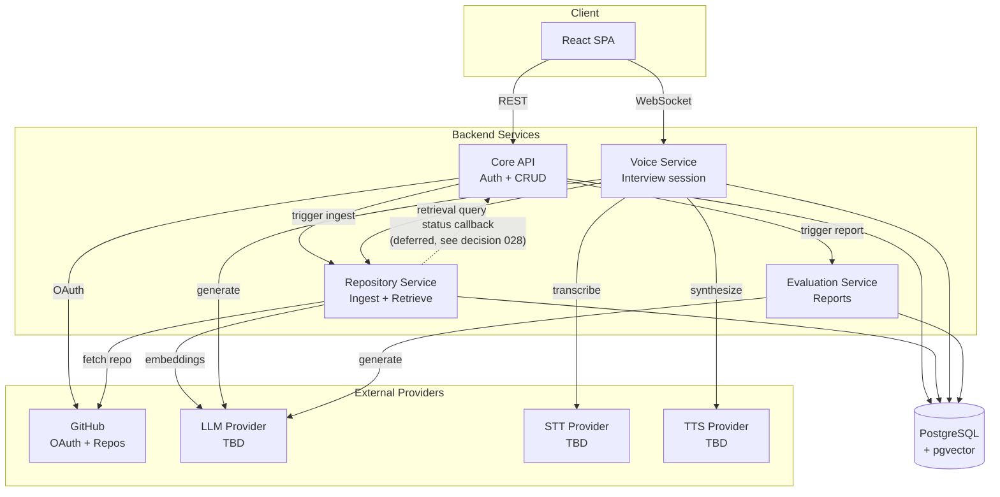

# Architecture

## Overview

RepoViva is built as **4 microservices** communicating over HTTP (and WebSocket for the interview session). Requirements, core entities, service split, and key architectural constraints have been decided. Specific external providers (STT, TTS, LLM) and the full data model are still open.

This document is the source of truth for the current architecture. See `decisions.md` for the reasoning behind each choice.

## Architecture Diagram



*The status-callback arrow is dashed to signal that this direction is designed but not implemented — see decision 028.*

## Components

### Core API service

Main REST entry point for the frontend. Owns:

- GitHub OAuth flow and session management
- User records
- Repository metadata (with ingestion status)
- Interview metadata (creation, listing, session token issuance)
- Report metadata (listing, retrieval — actual generation delegated to Evaluation Service)

Delegates:

- Ingestion trigger → Repository Service
- Report generation trigger → Evaluation Service
- Live interview session (WebSocket) → Voice Service

### Repository Service

Owns everything about a repository's code and its searchable representation:

- Fetches the repository from GitHub
- Parses, chunks, and embeds source code
- Persists chunks + embeddings (pgvector) to the shared database
- Exposes a retrieval endpoint used by Voice Service during interviews
- (Planned, see decision 028) Reports ingestion progress to Core API via authenticated callbacks

Runs ingestion asynchronously (long-running work; must not block API requests). See "Data Flow" below.

### Voice Service

Owns the live interview session:

- Terminates the WebSocket from the frontend
- Runs the STT → Repository Service lookup → LLM → TTS pipeline for each turn
- Persists each turn as it completes (question + transcribed answer)
- Handles session interruption gracefully (partial report is possible because turns are already persisted)

### Evaluation Service

Given a completed interview transcript, generates the final report:

- Called by Core API when an interview ends (or on partial-report request)
- Calls the LLM provider for report generation
- Writes the report to the shared database

Kept separate so report generation (potentially slow, batchable) does not compete with live-session latency.

### PostgreSQL (shared, with pgvector)

Single database, four schemas (one per service). Each service owns its own tables — no service reads or writes another service's tables directly. Cross-service data access goes through HTTP APIs.

## Core Entities

- **User** — the developer using RepoViva.
- **Repository** — a GitHub repo the user has connected.
- **Interview** — a mock interview session against a repository.
- **Turn** — one question and its answer, treated as a single unit.
- **Report** — the evaluation output at the end of an interview.

Fields per entity are deferred until each service's implementation clarifies exactly what state it must hold.

## API Surface

### REST — served by Core API (v1)

Auth
```
GET  /v1/auth/github/login       generates state cookie, redirects to GitHub
GET  /v1/auth/github/callback    validates state, exchanges code, sets session cookie
GET  /v1/me                      returns the current user (requires session cookie)
```

Repositories
```
POST /v1/repositories            body: { github_url }  → Repository (status=queued or failed)
GET  /v1/repositories            list current user's repos
GET  /v1/repositories/{id}       single repo, including ingestion status
```

Interviews
```
POST /v1/interviews              body: { repository_id }  → Interview + session token
                                 (only allowed if repo status = ready)
GET  /v1/interviews              list current user's interviews
GET  /v1/interviews/{id}         single interview
GET  /v1/interviews/{id}/report  the report
```

The current user is always derived from the auth token, never from request bodies.

### Internal service-to-service APIs

These are called only by other services, never exposed to the frontend. All internal calls are authenticated with HMAC-SHA256 (see decision 027).

**Implemented (slice 2 step 4):**

Core API → Repository Service (ingestion trigger)
```
POST /internal/v1/repositories/{repository_id}/ingest
body: { github_url: string }
→ 202 Accepted (fire-and-forget from Core API's perspective)
→ 401 Unauthorized (missing or invalid HMAC signature)
```

**Implemented (slice 3):**

Repository Service → Core API (status callback)

Repository Service → Core API (status callback)
```
POST /internal/v1/repositories/{repository_id}/events
body: {
  event_id:    <uuid v4>,
  event_type:  "ingestion.started" | "ingestion.completed" | "ingestion.failed",
  occurred_at: <ISO 8601 timestamp, UTC>,
  data:        { ... }   // shape depends on event_type
}

Response codes (planned):
- 202 Accepted — event received and processed
- 409 Conflict — event_id already seen (safe replay, no side effects)
- 422 Unprocessable Entity — illegal state transition
- 401 — missing or invalid HMAC signature
- 404 — unknown repository_id
```

**Planned for later slices:**
POST /internal/v1/repositories/{repository_id}/events
Headers: X-Repoviva-Timestamp, X-Repoviva-Signature (HMAC-SHA256)
body: {
event_id: <uuid v4>,
event_type: "ingestion.started" | "ingestion.completed" | "ingestion.failed",
occurred_at: <ISO 8601 timestamp, UTC>,
data: { error_message?: string, ... }
}

Response codes:

202 Accepted — event received and state transition applied
401 Unauthorized — missing or invalid HMAC signature
404 Not Found — unknown repository_id
422 Unprocessable Entity — illegal state transition (target row is
in a terminal state: ready or failed)


Deduplication by event_id is not implemented for MVP — see decision 029.

Voice Service → Repository Service (retrieval)
```
POST /internal/v1/retrieve
```
Returns top-K relevant code chunks for a query + repo. Detailed shape TBD.

Core API → Evaluation Service (report generation)
```
POST /internal/v1/reports
```
Generates a report for a completed (or partial) interview. Detailed shape TBD.

### WebSocket — served by Voice Service

Interview turns are not REST. Once an interview is created by Core API, the client connects a WebSocket to the Voice Service, presenting the session token issued by Core API.

First-sketch message protocol (to be refined during implementation):

Client → Server
- `session.start` (with interview_id + session token)
- `audio.chunk` (binary audio frames as user speaks)
- `audio.end` (optional client-side end-of-speech hint)

Server → Client
- `session.ready`
- `transcript.partial` / `transcript.final` (STT results for UI feedback)
- `question.text` (the question in text form for display / accessibility)
- `question.audio_chunk` (TTS audio streaming down)
- `turn.complete` (turn persisted)
- `session.end`
- `error`

## Data Flow

### Repository ingestion (current state — slice 3 step 1)

Ingestion is triggered synchronously and runs asynchronously inside
Repository Service. Status is reported back to Core API via HMAC-signed
HTTP callbacks (decisions 024–026, 029).

1. User submits a GitHub URL via `POST /v1/repositories` (Core API).
2. Core API validates the URL, creates a Repository row with status
   `queued`, and calls Repository Service's
   `POST /internal/v1/repositories/{id}/ingest` (HMAC-signed) with the
   GitHub URL in the body.
3. Repository Service verifies the HMAC signature and returns
   `202 Accepted` immediately. It schedules `run_ingestion` on
   FastAPI's `BackgroundTasks` and returns; the pipeline runs after
   the response is sent.
4. If the trigger call fails at step 2 (network error, timeout, non-2xx
   response), Core API marks the just-created row `failed` immediately
   with an `error_message` describing the failure, and returns 201 with
   that row. The user sees the row as `failed` right away.
5. Core API returns the created (or immediately-failed) Repository row
   to the client with a 201 response.
6. Repository Service's background pipeline runs: emit
   `ingestion.started` → shallow-clone the repo into
   `workspace/<repository_id>/` → walk, chunk, and embed the source
   tree via a per-repository CocoIndex App (decision 031), writing
   rows to the shared `code_chunks` table → emit `ingestion.completed`
   (or `ingestion.failed` with the fetch or indexing error). Each
   callback is an HMAC-signed `POST /internal/v1/repositories/{id}/events`
   on Core API.
7. Core API applies the loose state machine on each event (decision 029):
   `queued`/`in_progress` transitions to `in_progress`/`ready`/`failed`
   as dictated by the event; terminal states reject further events
   with 422.
8. Client polls `GET /v1/repositories/{id}` to observe the current
   status. States progress `queued → in_progress → ready` for
   successful ingestions, or `queued → in_progress → failed`
   (with `error_message` populated) for failed ones.

Chunking uses CocoIndex's syntax-aware `RecursiveSplitter`; embedding
is Voyage `voyage-4-lite` via CocoIndex's LiteLLM integration
(decision 030). `code_chunks`' DDL is owned by Repository Service
itself (`sql/schema.sql`, applied at startup), not by CocoIndex —
see decision 031 for why that split exists and what it fixed.

### Interview session (live, over WebSocket)

1. Client calls `POST /v1/interviews` on Core API (allowed only if repo status is `ready`). Core API creates the interview and returns a session token.
2. Client opens a WebSocket to Voice Service, presenting the session token.
3. Voice Service validates the token, retrieves repo context via Repository Service's `/internal/v1/retrieve`, generates the opening question via the LLM provider, and streams TTS audio down.
4. User speaks. Client streams audio frames up. Voice Service runs STT and VAD on the incoming stream.
5. On end-of-speech, Voice Service persists the completed turn (question + transcript), then queries Repository Service for context relevant to the user's answer, generates the next question via the LLM, and streams TTS down.
6. Loop until the interview ends.
7. On session end (normal or interrupted), Voice Service (or Core API) calls Evaluation Service to generate a report from all completed turns.

## Data Storage

- **PostgreSQL (shared, with pgvector)** — one database, per-service schemas:
   - Core API schema: users, repositories (metadata + status),
    interviews, encrypted OAuth tokens, reports (metadata).
    *A table for processed inbound event IDs may be added later
    if decision 029 is revisited and dedup becomes necessary.*
  - Repository Service schema: `code_chunks` (chunk text + Voyage
    embeddings, one row per code chunk, primary key
    `(repository_id, id)` — see decision 031). *Currently created in
    the default `public` schema, not a dedicated per-service schema
    — the per-service-schema split described here is not yet
    implemented for Repository Service; see decision 031's "Revisit
    when."* DDL lives in `repository-service/sql/schema.sql`,
    applied idempotently by `db.apply_schema()` at service startup —
    not by CocoIndex, which only writes rows to the table.
  - Voice Service schema: turns.
  - Evaluation Service schema: report content.
- **No raw audio storage** — audio is discarded after transcription.
 

## Current Constraints

- Single-region deployment is acceptable for MVP.
- Target scale: ~10 concurrent active interviews.
- Interview turn latency target: 4–5s p95 (aspirational 3s). Inter-service network hops eat some of this budget — see decisions 006 and 020.
- Ingestion target for small repos (<100 files): under 1 minute p95.
- Voice pipeline is DIY over a WebSocket; Voice Service orchestrates each stage (STT, retrieval, LLM, TTS) itself.
- User isolation is enforced at the data-access layer in Core API via a `get_current_user` dependency on protected routes, and at the service layer via queries always scoped by `owner_user_id`. `/health` and auth endpoints are the only unauthenticated routes.
- OAuth tokens are encrypted at the application layer (Core API). Everything else relies on disk-level encryption.
- Shared database across services with strict per-service table ownership (see decision 021).
- No API gateway — frontend calls Core API and Voice Service directly (see decision 022).
- Internal service-to-service HTTP calls are authenticated with HMAC-SHA256 over `timestamp + "." + body`, with a 60-second freshness window and a single shared secret (see decision 027). Each service implements its own HMAC module ("write it twice, deliberately") — the wire format is the contract.
- Ingestion status *is* observable end-to-end (decision 029, superseding decision 028): Repository Service emits HMAC-signed `ingestion.started`/`ingestion.completed`/`ingestion.failed` callbacks to Core API as the real pipeline runs, and Core API applies a loose state machine and exposes the current state via `GET /v1/repositories/{id}`. Callback delivery is not retried and events are not deduplicated — a callback dropped by network failure leaves the row in whatever state it was last set to, visible to the user as a stuck `queued`/`in_progress` until a later event (if any) corrects it. See decision 029's tradeoffs and revisit triggers.

## Future Evolution

Open decisions that will shape architecture:

- Choice of STT, TTS, and LLM providers
- Choice of background job system inside Repository Service. Real ingestion (clone → chunk → embed via CocoIndex, decisions 030–031) currently runs on FastAPI `BackgroundTasks`; revisit if concurrency, retries, or observability needs outgrow that.
- Whether to move off HTTP callbacks (decisions 024–026, 029) to a message broker — decision 029 names the revisit triggers (callback drop rate, event volume growth, a second event consumer)
- Choice of managed Postgres provider (Supabase or Neon)
- Full data model (fields per entity, per-service schemas)
- Final WebSocket message protocol
- Retry semantics for failed ingestions (retry-in-place vs new row)
- Logout endpoint (deferred — no state to clean up server-side, so it's a cookie-clear + redirect when needed)
- Whether to migrate from signed cookies to JWTs if the session payload grows
- Naming convention on `Base.metadata` to stop Alembic autogenerate from re-detecting constraint drift on every run (small cleanup after slice 2)

Deferred but named in `decisions.md`:

- Migrating from DIY voice pipeline to a realtime voice API if latency proves insufficient
- Live session resumption when partial reports prove too limiting
- Broader application-level encryption if the threat model changes
- Per-service databases if shared-DB coupling causes real problems