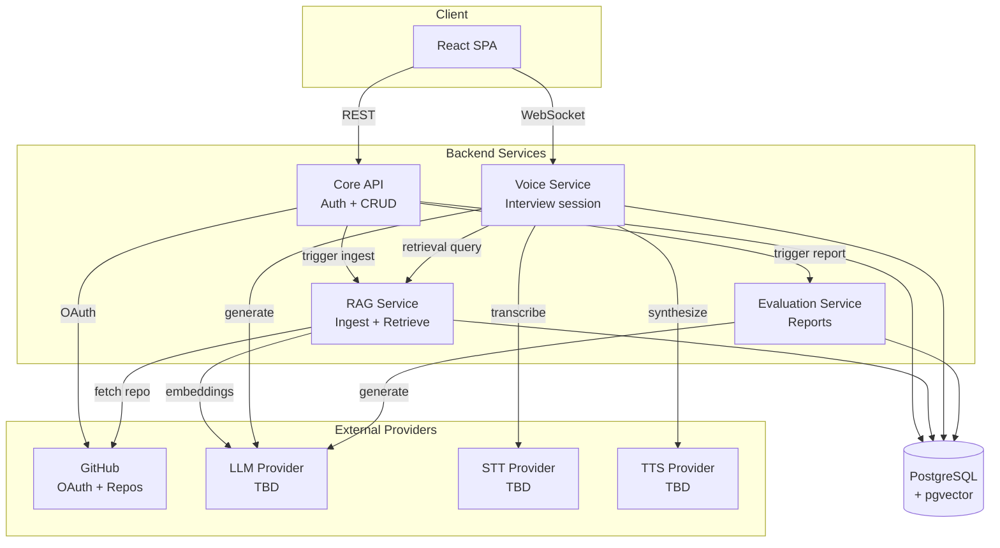

# Architecture
 
## Overview
 
RepoViva is built as **4 microservices** communicating over HTTP (and WebSocket for the interview session). Requirements, core entities, service split, and key architectural constraints have been decided. Specific external providers (STT, TTS, LLM) and the full data model are still open.
 
This document is the source of truth for the current architecture. See `decisions.md` for the reasoning behind each choice.
 
## Architecture Diagram
 

 
## Components

## Auth & Session

- Users authenticate via GitHub OAuth (OAuth App, not GitHub App — see decision 024).
- Login scope is `read:user` for MVP. `repo` will be added when RAG Service needs to read repository contents.
- The OAuth `state` parameter is stored in a signed cookie (10-minute lifetime).
- After successful login, Core API issues a signed session cookie carrying the user's internal ID (7-day lifetime).
- Both cookies use `itsdangerous` with a shared secret. Voice Service will validate sessions using the same secret — no cross-service call needed.
- GitHub access tokens are encrypted with Fernet (application-level, decision 005) before being stored on the user row.
 
### Core API service
 
Main REST entry point for the frontend. Owns:
 
- GitHub OAuth flow and session management
- User records
- Repository metadata (with ingestion status polled by the frontend)
- Interview metadata (creation, listing, session token issuance)
- Report metadata (listing, retrieval — actual generation delegated to Evaluation Service)
Delegates:
 
- Ingestion trigger → RAG Service
- Report generation trigger → Evaluation Service
- Live interview session (WebSocket) → Voice Service
### RAG Service
 
Owns everything about a repository's code and its searchable representation:
 
- Fetches the repository from GitHub
- Parses, chunks, and embeds source code
- Persists chunks + embeddings (pgvector) to the shared database
- Exposes a retrieval endpoint used by Voice Service during interviews
Runs ingestion asynchronously (long-running work; must not block API requests). See "Data Flow" below.
 
### Voice Service
 
Owns the live interview session:
 
- Terminates the WebSocket from the frontend
- Runs the STT → RAG lookup → LLM → TTS pipeline for each turn
- Persists each turn as it completes (question + transcribed answer)
- Handles session interruption gracefully (partial report is possible because turns are already persisted)
### Evaluation Service
 
Given a completed interview transcript, generates the final report:
 
- Called by Core API when an interview ends (or on partial-report request)
- Calls the LLM provider for report generation
- Writes the report to the shared database
Kept separate so report generation (potentially slow, batchable) does not compete with live-session latency.
 
### PostgreSQL (shared, with pgvector)
 
Single database, four schemas (one per service). Each service owns its own tables — no service reads or writes another service's tables directly. Cross-service data access goes through HTTP APIs.
 
## Core Entities
 
- **User** — the developer using RepoViva.
- **Repository** — a GitHub repo the user has connected.
- **Interview** — a mock interview session against a repository.
- **Turn** — one question and its answer, treated as a single unit.
- **Report** — the evaluation output at the end of an interview.
Fields per entity are deferred until each service's implementation clarifies exactly what state it must hold.
 
## API Surface
 
### REST — served by Core API (v1)
 
Auth
```
GET  /v1/auth/github/login       generates state cookie, redirects to GitHub
GET  /v1/auth/github/callback    validates state, exchanges code, sets session cookie
GET  /v1/me                      returns the current user (requires session cookie)
```
 
Repositories
```
POST /v1/repositories            body: { github_url }  → Repository (status=queued)
GET  /v1/repositories            list current user's repos
GET  /v1/repositories/{id}       single repo, including ingestion status
```
 
Interviews
```
POST /v1/interviews              body: { repository_id }  → Interview + session token
                                 (only allowed if repo status = ready)
GET  /v1/interviews              list current user's interviews
GET  /v1/interviews/{id}         single interview
GET  /v1/interviews/{id}/report  the report
```
 
The current user is always derived from the auth token, never from request bodies.
 
### Internal service-to-service APIs
 
These are called only by other services, never exposed to the frontend. Detailed shape TBD per implementation.
 
- **Core API → RAG Service:** `POST /internal/ingest` — enqueue a repository for ingestion.
- **Core API → Evaluation Service:** `POST /internal/reports` — generate a report for a completed (or partial) interview.
- **Voice Service → RAG Service:** `POST /internal/retrieve` — return the top-K relevant code chunks for a query + repo.
### WebSocket — served by Voice Service
 
Interview turns are not REST. Once an interview is created by Core API, the client connects a WebSocket to the Voice Service, presenting the session token issued by Core API.
 
First-sketch message protocol (to be refined during implementation):
 
Client → Server
- `session.start` (with interview_id + session token)
- `audio.chunk` (binary audio frames as user speaks)
- `audio.end` (optional client-side end-of-speech hint)
Server → Client
- `session.ready`
- `transcript.partial` / `transcript.final` (STT results for UI feedback)
- `question.text` (the question in text form for display / accessibility)
- `question.audio_chunk` (TTS audio streaming down)
- `turn.complete` (turn persisted)
- `session.end`
- `error`
## Data Flow
 
### Repository ingestion (asynchronous)
 
1. User submits a GitHub URL via `POST /v1/repositories` (Core API).
2. Core API validates the URL, confirms access via the user's OAuth token, creates a Repository row with status `queued`, calls RAG Service's `/internal/ingest`, and returns immediately.
3. Client polls `GET /v1/repositories/{id}` (Core API) to observe status transitions: `queued → in-progress → ready` (or `failed`). Core API reads status from its own table; RAG Service updates that status as it progresses (via a callback or by writing to a shared status field — TBD).
4. RAG Service fetches the repo, parses and analyzes it, builds the retrieval index, and sets status to `ready`.
5. On failure, status is set to `failed` and the user is shown an error with a retry option.
### Interview session (live, over WebSocket)
 
1. Client calls `POST /v1/interviews` on Core API (allowed only if repo status is `ready`). Core API creates the interview and returns a session token.
2. Client opens a WebSocket to Voice Service, presenting the session token.
3. Voice Service validates the token, retrieves repo context via RAG Service's `/internal/retrieve`, generates the opening question via the LLM provider, and streams TTS audio down.
4. User speaks. Client streams audio frames up. Voice Service runs STT and VAD on the incoming stream.
5. On end-of-speech, Voice Service persists the completed turn (question + transcript), then queries RAG Service for context relevant to the user's answer, generates the next question via the LLM, and streams TTS down.
6. Loop until the interview ends.
7. On session end (normal or interrupted), Voice Service (or Core API) calls Evaluation Service to generate a report from all completed turns.
## Data Storage
 
- **PostgreSQL (shared, with pgvector)** — one database, per-service schemas:
  - Core API schema: users, repositories (metadata + status), interviews, encrypted OAuth tokens, reports (metadata).
  - RAG Service schema: code chunks, embeddings, repository index state.
  - Voice Service schema: turns.
  - Evaluation Service schema: report content.
- **No raw audio storage** — audio is discarded after transcription.
## Current Constraints
 
- Single-region deployment is acceptable for MVP.
- Target scale: ~10 concurrent active interviews.
- Interview turn latency target: 4–5s p95 (aspirational 3s). Inter-service network hops eat some of this budget — see decisions 006 and 020.
- Ingestion target for small repos (<100 files): under 1 minute p95.
- Voice pipeline is DIY over a WebSocket; Voice Service orchestrates each stage (STT, retrieval, LLM, TTS) itself.
- User isolation is enforced at the data-access layer in Core API via a get_current_user dependency on protected routes. /health and auth endpoints are the only unauthenticated routes.
- OAuth tokens are encrypted at the application layer (Core API). Everything else relies on disk-level encryption.
- Shared database across services with strict per-service table ownership (see decision 021).
- No API gateway — frontend calls Core API and Voice Service directly (see decision 022).
## Future Evolution
 
Open decisions that will shape architecture:
 
- Choice of STT, TTS, and LLM providers
- Choice of background job system inside RAG Service
- Choice of managed Postgres provider (Supabase or Neon)
- Full data model (fields per entity, per-service schemas)
- Final WebSocket message protocol
- Whether inter-service auth uses shared secret, mTLS, or JWT (currently unspecified)
- Logout endpoint (deferred — no state to clean up server-side, so it's a cookie-clear + redirect when needed).
- Whether to migrate from signed cookies to JWTs if the session payload grows.
Deferred but named in `decisions.md`:
 
- Migrating from DIY voice pipeline to a realtime voice API if latency proves insufficient
- Live session resumption when partial reports prove too limiting
- Broader application-level encryption if the threat model changes
- Per-service databases if shared-DB coupling causes real problems
 