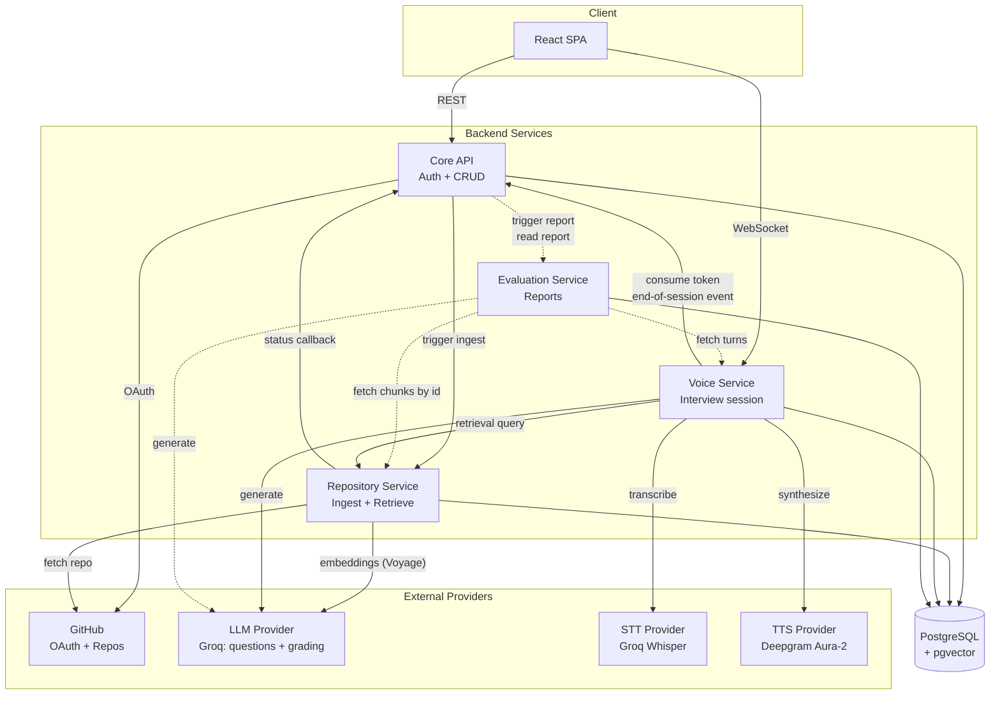

# Architecture

## Overview

RepoViva is built as **4 microservices** communicating over HTTP (and WebSocket for the interview session). Requirements, core entities, service split, and key architectural constraints have been decided. The speech providers are chosen: Groq for question generation (decision 038) and STT (decision 043), Deepgram for TTS (decision 044). The full data model is still open.

This document is the source of truth for the current architecture. See `decisions.md` for the reasoning behind each choice.

## Architecture Diagram


```mermaid
flowchart TB
    subgraph "Client"
        FE[React SPA]
    end

    subgraph "Backend Services"
        CORE[Core API<br/>Auth + CRUD]
        REPO[Repository Service<br/>Ingest + Retrieve]
        VOICE[Voice Service<br/>Interview session]
        EVAL[Evaluation Service<br/>Reports]
    end

    DB[(PostgreSQL<br/>+ pgvector)]

    subgraph "External Providers"
        GH[GitHub<br/>OAuth + Repos]
        LLM[LLM Provider<br/>Groq: questions + grading]
        STT[STT Provider<br/>Groq Whisper]
        TTS[TTS Provider<br/>Deepgram Aura-2]
    end

    FE -- REST --> CORE
    FE -- WebSocket --> VOICE

    CORE -- trigger ingest --> REPO
    REPO -- status callback --> CORE
    CORE -. trigger report<br/>read report .-> EVAL
    EVAL -. fetch turns .-> VOICE
    EVAL -. fetch chunks by id .-> REPO
    VOICE -- retrieval query --> REPO
    VOICE -- consume token<br/>end-of-session event --> CORE

    CORE --> DB
    REPO --> DB
    VOICE --> DB
    EVAL --> DB

    CORE -- OAuth --> GH
    REPO -- fetch repo --> GH
    REPO -- embeddings (Voyage) --> LLM
    VOICE -- transcribe --> STT
    VOICE -- generate --> LLM
    VOICE -- synthesize --> TTS
    EVAL -. generate .-> LLM
```

*Dashed arrows are designed but not yet implemented: report generation (Evaluation Service, decisions 049–051).*

## Components

### Core API service

Main REST entry point for the frontend. Owns:

- GitHub OAuth flow and session management
- User records
- Repository metadata (with ingestion status)
- Interview metadata (creation, listing, session token issuance and consumption)
- Report access for the frontend: checks ownership, then proxies to Evaluation Service, which owns the report and its status (decision 049)

Delegates:

- Ingestion trigger → Repository Service
- Report generation trigger → Evaluation Service
- Live interview session (WebSocket) → Voice Service

### Repository Service

Owns everything about a repository's code and its searchable representation:

- Fetches the repository from GitHub
- Parses, chunks, and embeds source code
- Persists chunks + embeddings (pgvector) to the shared database
- Exposes a retrieval endpoint used by Voice Service during interviews
- Reports ingestion progress to Core API via HMAC-signed callbacks (decision 029)

Runs ingestion asynchronously (long-running work; must not block API requests). See "Data Flow" below.

### Voice Service

Owns the live interview session:

- Terminates the WebSocket from the frontend and admits it by consuming the session token through Core API (decision 035)
- Runs each turn: Repository Service lookup → LLM → TTS streamed to the client, then the candidate's audio → STT (decisions 043–045)
- Persists each turn in its own `turns` table: the question when it's asked, the answer when it arrives (decision 040)
- Reports the end of each session to Core API as `completed` or `interrupted` (decision 041). An interruption still leaves a partial record because turns are already persisted

### Evaluation Service

Generates the end-of-interview report (decisions 049–051):

- Triggered by Core API when an interview ends, `completed` or `interrupted`. Generation runs in the background
- Fetches the turns from Voice Service and the exact code chunks each question came from (`retrieved_chunk_ids`) from Repository Service, over HMAC-signed HTTP
- Grades each answered turn in its own LLM call: correctness and clarity on 1–5, strengths, gaps, and 2–4 key points of a strong answer, each citing the turn's chunks. Citations are checked in code (decision 050)
- Writes a summary. Averages are computed in code, the prose by one more LLM call
- Stores the report in its own `reports` table and serves it to Core API
- An interrupted interview gets a partial report: unanswered turns are listed, not scored (decision 008)

Kept separate so report generation (slow, rate-limited) does not compete with live-session latency.

### PostgreSQL (shared, with pgvector)

Single database, four schemas (one per service). Each service owns its own tables — no service reads or writes another service's tables directly. Cross-service data access goes through HTTP APIs.

## Core Entities

- **User** — the developer using RepoViva.
- **Repository** — a GitHub repo the user has connected.
- **Interview** — a mock interview session against a repository. Fields and lifecycle: decision 036.
- **Turn** — one question and its answer, treated as a single unit.
- **Report** — the evaluation output at the end of an interview.

Fields per entity are deferred until each service's implementation clarifies exactly what state it must hold.

## API Surface

### REST — served by Core API (v1)

Auth
```
GET  /v1/auth/github/login       generates state cookie, redirects to GitHub
GET  /v1/auth/github/callback    validates state, exchanges code, sets session cookie
GET  /v1/me                      returns the current user (requires session cookie)
```

Repositories
```
POST /v1/repositories            body: { github_url }  → Repository (status=queued or failed)
GET  /v1/repositories            list current user's repos
GET  /v1/repositories/{id}       single repo, including ingestion status
```

Interviews
```
POST /v1/interviews              body: { repository_id }  → Interview + session token   [implemented]
                                 201; 404 if repo missing or not yours; 409 if repo not `ready`
                                 The raw token appears ONLY in this response (decision 035)
GET  /v1/interviews              list current user's interviews, newest first            [implemented]
GET  /v1/interviews/{id}         single interview; 404 if missing or not yours           [implemented]
GET  /v1/interviews/{id}/report  the report: 200 ready/failed, 202 generating,          [planned]
                                 404 if missing, not yours or not ended (decision 049)
```

The current user is always derived from the auth token, never from request bodies.

### Internal service-to-service APIs

These are called only by other services, never exposed to the frontend. All internal calls are authenticated with HMAC-SHA256 (see decision 027).

**Implemented (slice 2 step 4):**

Core API → Repository Service (ingestion trigger)
```
POST /internal/v1/repositories/{repository_id}/ingest
body: { github_url: string }
→ 202 Accepted (fire-and-forget from Core API's perspective)
→ 401 Unauthorized (missing or invalid HMAC signature)
```

**Implemented (slice 3):**

Repository Service → Core API (status callback)
```
POST /internal/v1/repositories/{repository_id}/events
Headers: X-Repoviva-Timestamp, X-Repoviva-Signature (HMAC-SHA256)
body: {
  event_id:    <uuid v4>,
  event_type:  "ingestion.started" | "ingestion.completed" | "ingestion.failed",
  occurred_at: <ISO 8601 timestamp, UTC>,
  data:        { error_message?: string, ... }   // shape depends on event_type
}
→ 202 Accepted — event received and state transition applied
→ 401 Unauthorized — missing or invalid HMAC signature
→ 404 Not Found — unknown repository_id
→ 422 Unprocessable Entity — illegal state transition (target row is
  in a terminal state: ready or failed)
```

Deduplication by event_id is not implemented for MVP — see decision 029.

**Implemented (retrieval endpoint):**

Voice Service → Repository Service (retrieval)
```
POST /internal/v1/repositories/{repository_id}/retrieve
body: {
  query: string,
  top_k?: int = 10,               // 1-50
  filename_prefix?: string,
  exclude_chunk_ids?: int[] = []
}
→ 200 OK: { chunks: [ { id, content, filename, start_line, end_line,
                         language, similarity }, ... ] }
→ 401 Unauthorized (missing or invalid HMAC signature)
→ 422 Unprocessable Entity (malformed body — FastAPI's default
  validation response)
→ 502 Bad Gateway (embedding provider call failed)
```
Always 200 with `chunks: []` if nothing matches — Repository Service has
no local record of ingestion status (that lives in Core API, reached only
via outbound callbacks, never queried back), so it cannot distinguish
"unknown repository_id" from "ingestion still running" from "done." Core
API already gates `POST /v1/interviews` on repo status `ready`, so by the
time this endpoint is called ingestion is expected to be complete. See
`decisions.md` for the full reasoning.

Nearest chunks are found via pgvector cosine distance (`<=>`) against
`code_chunks.embedding`, scoped to `repository_id` only — no `commit_sha`
filter, since no re-ingestion path exists yet and an interview session
references a repository, not a specific commit.

**Implemented (decision 035):**

Voice Service → Core API (session token consumption, once per session)
```
POST /internal/v1/session-tokens/consume
body: { token: string }            // 1–128 chars
→ 200 { interview_id, user_id, repository_id }
→ 403 { reason: "unknown" | "expired" | "consumed" }
→ 401 (bad HMAC)  → 422 (malformed body)
```
One conditional `UPDATE` both validates and consumes the token. It
requires the hash to match, the token to be unconsumed and unexpired,
and the interview's status to be `created`. The same statement moves the
interview to `active` (decision 036), so concurrent calls with the same
token can't both succeed. The endpoint is not idempotent: a second call
gets 403 `consumed`. Implementation notes are under decision 035.

**Implemented (decisions 036, 041):**

Voice Service → Core API (end of session)
```
POST /internal/v1/interviews/{interview_id}/events
body: { event_id, event_type: "interview.completed" | "interview.interrupted",
        occurred_at, data: { error_message? } }
→ 202  → 401  → 404  → 422 (illegal transition)
```
Strict transitions: only an `active` interview can end, so a repeated end
event gets 422. Sets `ended_at`, plus `error_message` (truncated to 1000
characters) on `interrupted`. Voice Service sends it best-effort, with no
retry, like ingestion events.

**Planned:**

Decision 049 has the full contract and recovery rules.

Core API → Evaluation Service (report trigger and read)
```
POST /internal/v1/reports
body: { interview_id, repository_id, outcome: "completed" | "interrupted" }
→ 202  (no-op if the report is ready or generating; regenerates a failed one)

GET  /internal/v1/reports/{interview_id}
→ 200 { status: "generating" | "ready" | "failed", partial, summary,
        turn_evaluations, model, prompt_version, error_message }
→ 404 no report
```

Evaluation Service → Voice Service (turns)
```
GET /internal/v1/interviews/{interview_id}/turns
→ 200 { turns: [ { seq, question_text, answer_text, status, retrieved_chunk_ids } ] }
```

Evaluation Service → Repository Service (chunks by id)
```
POST /internal/v1/repositories/{repository_id}/chunks
body: { ids: int[] }   // 1–200
→ 200 { chunks: [ { id, content, filename, start_line, end_line, language } ] }
```

### WebSocket — served by Voice Service

Interview turns are not REST. Once an interview is created by Core API, the client connects a WebSocket to the Voice Service, presenting the session token issued by Core API.

**Protocol v2: implemented (decisions 039, 045).** Endpoint
`ws://<voice-service>/v1/ws/interview`. JSON text frames shaped
`{ "type": ..., ...fields }` carry control messages; binary frames carry
audio.

```
Client → Server
  session.start  { token }          must be the first message, within 10 s
  <binary>                          answer audio: PCM16 LE, 16 kHz, mono
  audio.end      {}                 the frames since the last answer are one answer
  answer.text    { text }           1–5000 chars; typed fallback (dev, accessibility)
  session.end    {}                 user stops early → counts as completed (decision 041)

Server → Client
  session.ready       { interview_id }
  question.text       { turn_id, seq, text }   sent before the audio, as captions
  <binary>                                      question audio: PCM16 LE, 24 kHz, mono
  question.audio_end  { turn_id }               all audio sent; the client may open the mic
  transcript.final    { turn_id, text }         what STT heard
  turn.complete       { turn_id }               answer persisted
  session.end         { reason: "completed" | "ended_by_client" }
  error               { code, message }
```

Error codes that keep the socket open and the turn waiting:
`bad_message`, `no_speech` (empty audio or blank transcript),
`answer_too_long` (over `MAX_ANSWER_SECONDS`, default 180). `internal_error`
precedes a 1011 close.

Close codes: `1000` normal end · `1008` missing, invalid or rejected
token (one generic reason; the specific 403 reason is only logged,
decision 035) · `1011` internal failure (Core API unreachable at admission,
or the session failed mid-way, including an STT or TTS provider error).

## Data Flow

### Repository ingestion (current state — slice 3 step 1)

Ingestion is triggered synchronously and runs asynchronously inside
Repository Service. Status is reported back to Core API via HMAC-signed
HTTP callbacks (decisions 024–026, 029).

1. User submits a GitHub URL via `POST /v1/repositories` (Core API).
2. Core API validates the URL, creates a Repository row with status
   `queued`, and calls Repository Service's
   `POST /internal/v1/repositories/{id}/ingest` (HMAC-signed) with the
   GitHub URL in the body.
3. Repository Service verifies the HMAC signature and returns
   `202 Accepted` immediately. It schedules `run_ingestion` on
   FastAPI's `BackgroundTasks` and returns; the pipeline runs after
   the response is sent.
4. If the trigger call fails at step 2 (network error, timeout, non-2xx
   response), Core API marks the just-created row `failed` immediately
   with an `error_message` describing the failure, and returns 201 with
   that row. The user sees the row as `failed` right away.
5. Core API returns the created (or immediately-failed) Repository row
   to the client with a 201 response.
6. Repository Service's background pipeline runs: emit
   `ingestion.started` → shallow-clone the repo into
   `workspace/<repository_id>/` → walk, chunk, and embed the source
   tree via a per-repository CocoIndex App (decision 031), writing
   rows to the shared `code_chunks` table → emit `ingestion.completed`
   (or `ingestion.failed` with the fetch or indexing error). Each
   callback is an HMAC-signed `POST /internal/v1/repositories/{id}/events`
   on Core API.
7. Core API applies the loose state machine on each event (decision 029):
   `queued`/`in_progress` transitions to `in_progress`/`ready`/`failed`
   as dictated by the event; terminal states reject further events
   with 422.
8. Client polls `GET /v1/repositories/{id}` to observe the current
   status. States progress `queued → in_progress → ready` for
   successful ingestions, or `queued → in_progress → failed`
   (with `error_message` populated) for failed ones.

Chunking uses CocoIndex's syntax-aware `RecursiveSplitter`; embedding
is Voyage `voyage-4-lite` via CocoIndex's LiteLLM integration
(decision 030). `code_chunks`' DDL is owned by Repository Service
itself (`sql/schema.sql`, applied at startup), not by CocoIndex —
see decision 031 for why that split exists and what it fixed.

### Interview session (live, over WebSocket)

1. Client calls `POST /v1/interviews` on Core API (allowed only if repo status is `ready`). Core API creates the interview and returns a session token.
2. Client opens a WebSocket to Voice Service and sends the session token in its first message, `session.start` — not in the URL, which is commonly logged (decision 035).
3. Voice Service consumes the token via Core API's `/internal/v1/session-tokens/consume`. This happens once per session; it also moves the interview to `active` and returns its `repository_id`. Voice Service then replies `session.ready`.
4. **Opening turn:** retrieve with the fixed seed query (decision 042) → generate the question with Groq (decisions 034, 038) → insert the turn as `asked` → send `question.text` → stream the question's audio from Deepgram as binary frames, then `question.audio_end` (decision 044).
5. The user answers. The client streams microphone audio as binary frames and sends `audio.end` when the user stops. Voice Service compresses the buffered audio to MP3 (decision 047) and transcribes it with Groq Whisper, using the question as prompt (decision 043), sends `transcript.final`, records the answer (turn → `answered`) and sends `turn.complete`. Silence or an over-long answer gets an `error` and the turn waits for another try.
6. **Follow-up turns:** retrieve with the previous question plus the answer, excluding every chunk already used → generate with the full history → ask. Repeat until `MAX_QUESTIONS` (default 6) or the client sends `session.end`.
7. On session end, Voice Service reports `interview.completed` (budget reached or user stopped) or `interview.interrupted` (disconnect or error) to Core API (decisions 036, 041). Core API then triggers the report (see below).

Each turn's `timings` records `retrieval_ms`, `llm_ms`, `tts_first_byte_ms`, `tts_ms` and `stt_ms`, and the same values are logged. Together they cover decision 006's latency path, from the end of the user's speech (STT) to the next question's audio starting (retrieval, LLM, TTS first byte).

### Report generation (planned — decisions 049–051)

1. Core API applies the end event, then sends `POST /internal/v1/reports` to Evaluation Service. Best-effort, no retry.
2. Evaluation Service upserts the `reports` row as `generating`, returns 202, and runs the pipeline in the background.
3. It fetches the turns from Voice Service and their chunks from Repository Service.
4. It grades each answered turn with `gpt-oss-120b` on Groq, one call at a time with back-off on 429, then writes the summary. Status becomes `ready`, or `failed` with `error_message`.
5. The client polls `GET /v1/interviews/{id}/report` on Core API, which checks ownership and proxies to Evaluation Service.

Recovery: if the trigger was lost, the first read gets a 404 from Evaluation, so Core API re-sends the trigger and answers 202. On startup, Evaluation resumes every report still `generating`.

## Data Storage

- **PostgreSQL (shared, with pgvector)** — one database, per-service schemas:
   - Core API schema: users, repositories (metadata + status),
    interviews, encrypted OAuth tokens. No report data (decision 049).
    *A table for processed inbound event IDs may be added later
    if decision 029 is revisited and dedup becomes necessary.*
  - Repository Service schema: `code_chunks` (chunk text + Voyage
    embeddings, one row per code chunk, primary key
    `(repository_id, id)` — see decision 031). *Currently created in
    the default `public` schema, not a dedicated per-service schema
    — the per-service-schema split described here is not yet
    implemented for Repository Service; see decision 031's "Revisit
    when."* DDL lives in `repository-service/sql/schema.sql`,
    applied idempotently by `db.apply_schema()` at service startup —
    not by CocoIndex, which only writes rows to the table.
  - Voice Service schema: `turns`, one row per question and answer
    (decision 040). It records `retrieved_chunk_ids` and per-stage
    `timings`, and has no foreign key to `interviews`. DDL lives in
    `voice-service/sql/schema.sql` and is applied at startup. *Also in
    `public` for now, like `code_chunks`.*
  - Evaluation Service schema: `reports`, one row per interview
    (`interview_id` UNIQUE, no foreign key), with `status`, `partial`,
    `model`, `prompt_version`, and `summary` and `turn_evaluations` as
    JSONB (decisions 049, 050). DDL in `evaluation-service/sql/schema.sql`,
    applied at startup.
- **No raw audio storage** — audio is discarded after transcription.
 

## Current Constraints

- Single-region deployment is acceptable for MVP.
- Target scale: ~10 concurrent active interviews.
- Interview turn latency target: 4–5s p95 (aspirational 3s). Inter-service network hops eat some of this budget — see decisions 006 and 020.
- Ingestion target for small repos (<100 files): under 1 minute p95.
- Voice pipeline is DIY over a WebSocket; Voice Service orchestrates each stage (STT, retrieval, LLM, TTS) itself.
- User isolation is enforced at the data-access layer in Core API via a `get_current_user` dependency on protected routes, and at the service layer via queries always scoped by `owner_user_id`. `/health` and auth endpoints are the only unauthenticated routes.
- OAuth tokens are encrypted at the application layer (Core API). Everything else relies on disk-level encryption.
- Shared database across services with strict per-service table ownership (see decision 021).
- No API gateway — frontend calls Core API and Voice Service directly (see decision 022).
- Internal service-to-service HTTP calls are authenticated with HMAC-SHA256 over `timestamp + "." + body`, with a 60-second freshness window and a single shared secret (see decision 027). Each service implements its own HMAC module ("write it twice, deliberately") — the wire format is the contract.
- Ingestion status *is* observable end-to-end (decision 029, superseding decision 028): Repository Service emits HMAC-signed `ingestion.started`/`ingestion.completed`/`ingestion.failed` callbacks to Core API as the real pipeline runs, and Core API applies a loose state machine and exposes the current state via `GET /v1/repositories/{id}`. Callback delivery is not retried and events are not deduplicated — a callback dropped by network failure leaves the row in whatever state it was last set to, visible to the user as a stuck `queued`/`in_progress` until a later event (if any) corrects it. See decision 029's tradeoffs and revisit triggers.
- Core API's Alembic autogenerate manages only tables with a Core API model (`include_object` hook, decision 037); other services' tables in the shared database are invisible to it.

## Future Evolution

Open decisions that will shape architecture:

- Choice of background job system inside Repository Service. Real ingestion (clone → chunk → embed via CocoIndex, decisions 030–031) currently runs on FastAPI `BackgroundTasks`; revisit if concurrency, retries, or observability needs outgrow that.
- Whether to move off HTTP callbacks (decisions 024–026, 029) to a message broker — decision 029 names the revisit triggers (callback drop rate, event volume growth, a second event consumer)
- Choice of managed Postgres provider (Supabase or Neon)
- Full data model (fields per entity, per-service schemas)
- Streaming STT (live captions, server-side end-of-speech detection) and barge-in (decisions 043, 045)
- Stuck `active` interviews after a Voice Service crash (decision 036's revisit trigger)
- Retry semantics for failed ingestions (retry-in-place vs new row)
- Logout endpoint (deferred — no state to clean up server-side, so it's a cookie-clear + redirect when needed)
- Whether to migrate from signed cookies to JWTs if the session payload grows
- Naming convention on `Base.metadata` to stop Alembic autogenerate from re-detecting constraint drift on every run (small cleanup after slice 2)
- Repository deletion as a cross-service flow (Core API rows, Repository Service chunks and workspace, Voice turns, Evaluation reports); revisit `interviews.repository_id`'s `ON DELETE NO ACTION` as part of it

Deferred but named in `decisions.md`:

- Migrating from DIY voice pipeline to a realtime voice API if latency proves insufficient
- Live session resumption when partial reports prove too limiting
- Broader application-level encryption if the threat model changes
- Per-service databases if shared-DB coupling causes real problems
